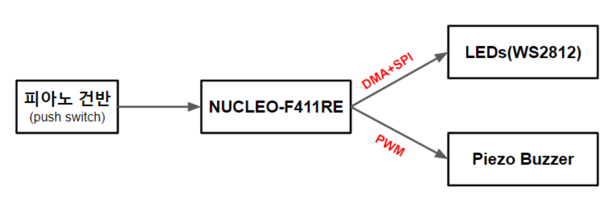

# 23-1 임베디드 프로세서 응용 Final Project

본 Final Project의 목표는 피아노 건반을 누를 때마다 NUCELO-F411RE와 WS2812 LED bar간의 DMA 및 SPI 통신을 통해 색상을 제어하고, 피에조 부저로 PWM신호를 송신하여 특정 음계를 출력하는 것이다.

**[결과 예시]**

[YouTube LINK](https://youtu.be/sW-dLjTRV7A)
